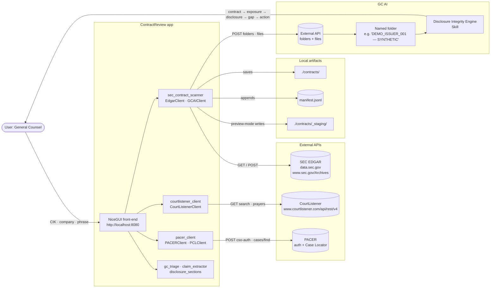
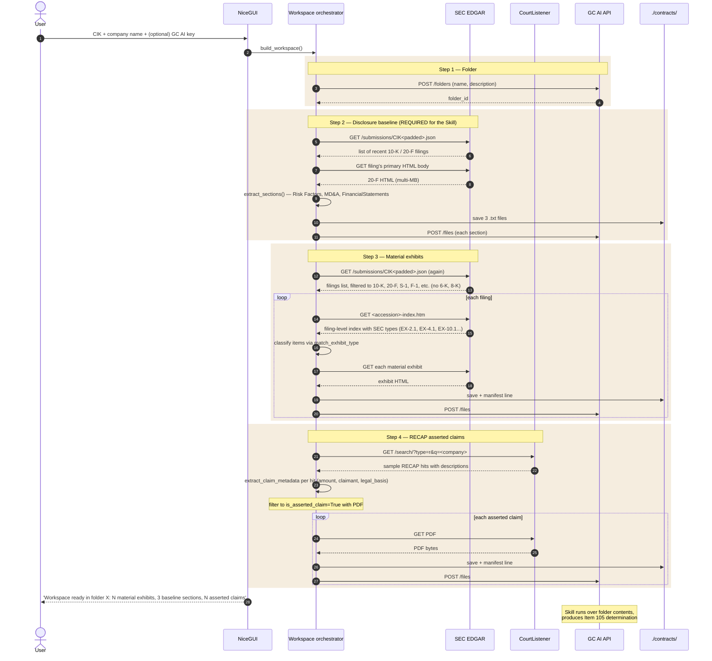
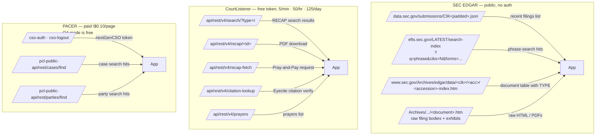
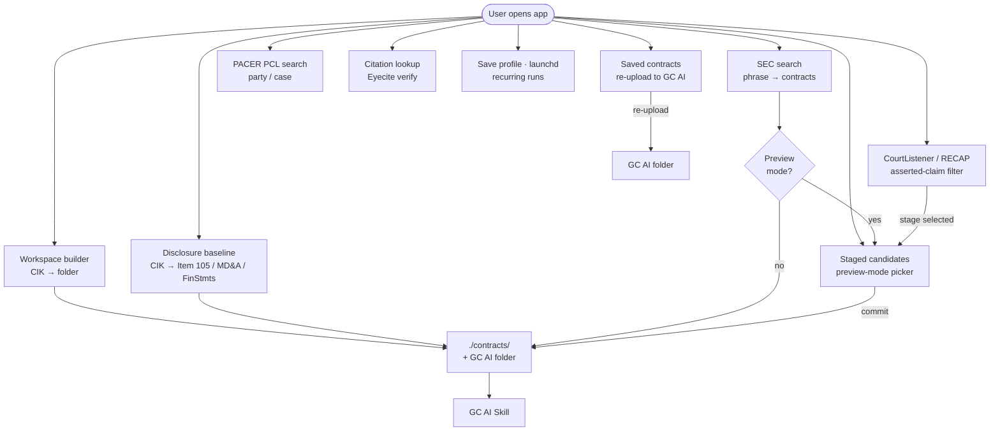

# ContractReview · Disclosure Integrity Engine — Architecture Wireframe

This document maps the data flow through ContractReview: inputs, API
interactions, the workflow inside the app, and the handoff to GC AI
where the Skill executes the actual Item 105 disclosure-adequacy
analysis.

> **Synthetic placeholder data:** Every `DEMO_*` token, zero identifier,
> future date, filename, and claim value below is a placeholder. None
> describes a client, matter, SEC filing, court record, or measured run.

---

## 1. System context



**Read it as:** the user enters an issuer (CIK + name) and clicks one
button. ContractReview pulls from three external data sources, drops
the artifacts into a local folder + manifest, and (with a GC AI key)
mirrors them into a named GC AI folder. The Skill running inside GC
AI then reads the folder and produces an audit-ready Item 105
disclosure determination.

---

## 2. Headline workflow — Workspace builder

The "Build workspace" action is the headline path. One click triggers
four parallel data-collection steps, all targeting a single GC AI
folder named after the company.



---

## 3. Data sources (what gets pulled)



| Source | What we pull | Why |
|---|---|---|
| EDGAR submissions JSON | Issuer's filing history | Enumerate by CIK without phrase |
| EDGAR full-text search | Cross-issuer phrase matches | Standalone "find every filer mentioning X" |
| EDGAR filing index HTML | Document table with SEC types | Classify Ex 2 / 4 / 9 / 10 vs boilerplate |
| EDGAR Archives | Raw HTML + PDFs | The contracts themselves |
| CourtListener `/search/?type=r` | RECAP docket / document hits | Federal court asserted-claim signal |
| CourtListener PDFs | Free archived court documents | Stage as asserted-claim evidence |
| CourtListener citations | Eyecite citation verification | Hallucination check |
| PACER PCL | Federal court case index | Live party/case search (paid) |
| GC AI External API | Folders + files | Final delivery to the Skill |

---

## 4. Per-document data shape

Every artifact saved locally appends one line to `manifest.jsonl`. The
schema is the same regardless of source so the Skill can read it
uniformly.

```jsonc
{
  "source": "sec" | "sec-disclosure" | "recap",
  "accession": "0000000000-00-000000",
  "cik": "0000000000",
  "form": "DEMO-FORM",
  "filed": "2099-12-31",
  "company": "DEMO_ISSUER_001",
  "document": "demo-exhibit-001.htm",  // suffixed with #<section> for sec-disclosure rows
  "exhibit": "4" | "10" | "primary" | "disclosure" | "recap",
  "url": "https://example.invalid/sec/demo-exhibit-001.htm",
  "saved_as": "2099-12-31_DEMO_ISSUER_001_0000000000-00-000000_demo-exhibit-001.htm",

  // sec-disclosure rows only
  "section": "RiskFactors" | "MDA" | "FinancialStatements",
  "section_label": "Risk Factors",
  "char_count": 12000,

  // recap asserted-claim rows only
  "is_asserted_claim": true,
  "claim_amount": 12345,
  "claim_currency": "USD",
  "claim_claimant": "DEMO_CLAIMANT_001",
  "claim_legal_basis": "DEMO_LEGAL_BASIS",
  "claim_document_type": "DEMO_DOCUMENT_TYPE",
  "court": "DEMO_COURT",

  // GC AI fields, populated when uploaded
  "gc_ai_file_id": "uuid",
  "gc_ai_folder_id": "uuid",
  "gc_ai_status": "uploaded",
  "gc_ai_error": "..."  // only on failure
}
```

---

## 5. Workflow modes (what the user can do)

The Workspace builder is the headline path; six other entry points
exist for ad-hoc work.



| Mode | Use case | Inputs | Outputs |
|---|---|---|---|
| **Workspace builder** | Build full GC AI workspace for one issuer | CIK + company name | Folder + manifest with baseline + contracts + asserted claims |
| SEC search | Find every filer mentioning phrase X | Phrase, optional CIK filter | Contracts (auto-save or staged) |
| Disclosure baseline | Pull just the Skill's required sections | CIK | Risk Factors / MD&A / FinancialStatements |
| Staged candidates | Review before committing | Preview-mode SEC scan output | User-selected commits |
| Saved contracts | Re-upload existing files to GC AI | Selected manifest rows | New GC AI folder |
| PACER PCL search | Live federal court party/case lookup | Auth token + criteria | PCL hits (paid in production) |
| CourtListener RECAP | Free archived court documents + asserted-claim signal | CL token + query | Stageable PDFs with claim metadata |
| Citation lookup | Verify cites in pasted text | CL token + text | Citation table with status |
| Save profile / schedule | Persist run config + macOS launchd plist | Current SEC inputs + schedule | profiles/&lt;name&gt;.json + plist snippet |

---

## 6. Handoff to GC AI

The local artifacts are the input the Skill consumes. The Skill is a
separate execution context running inside GC AI; ContractReview's job
is to deliver a properly-shaped folder and stop.

```mermaid
flowchart LR
    subgraph App[ContractReview]
        Folder[./contracts/<br/>+ manifest.jsonl]
    end

    subgraph Transit[Encrypted in transit]
        HTTPS[HTTPS multipart upload<br/>POST /api/external/v1/files]
    end

    subgraph GCAI[GC AI]
        GCFolder[Named folder]
        Schema[Schema-aware ingestion:<br/>filename + manifest fields]
        Skill[Disclosure Integrity Skill]
        Output[Skill output]
    end

    Folder -->|GCAIClient.upload_file| HTTPS
    HTTPS --> GCFolder
    GCFolder --> Schema
    Schema --> Skill
    Skill --> Output

    subgraph SkillProcess[Inside the Skill]
        S1[1. Locate Risk Factors section<br/>REQUIRED BASELINE]
        S2[2. Identify contract-derived risks]
        S3[3. Apply Temporal Relevance Test]
        S4[4. Apply Asserted Claim Materiality Rule<br/>if claim_amount + claimant + legal_basis present]
        S5[5. Map contract → SEC disclosure]
        S6[6. Classify Fully / Partially / Not Disclosed]
        S7[7. Apply Item 105 Legal Sufficiency Test]
        S8[8. Severity 🔴 🟠 🟡 🟢]
        S9[9. Emit Risk Mapping Table +<br/>Executive Summary +<br/>Recommended Disclosure Improvements]
    end

    Skill --- S1
    S1 --> S2 --> S3 --> S4 --> S5 --> S6 --> S7 --> S8 --> S9
```



**Skill-recognizable artifacts in the folder:**

| Filename pattern | Type | Drives |
|---|---|---|
| `<company>_<form>_<filed>_RiskFactors.txt` | Disclosure baseline | Skill's REQUIRED BASELINE |
| `<company>_<form>_<filed>_MDA.txt` | Materiality context | Materiality calibration |
| `<company>_<form>_<filed>_FinancialStatements.txt` | Magnitude context | Materiality calibration |
| `<filed>_<company>_<accession>_<exhibit>.htm` | Material contract (Ex 2/4/9/10) | Contract-derived risk extraction |
| `<filed>_<court>_<docket>_AssertedClaim_<currency><amount>_<doc>.pdf` | RECAP asserted claim | Asserted Claim Materiality Rule |

The filename convention is intentional — the Skill identifies document
type from the name alone, even before reading the file, so its
ingestion is robust to manifest absence or partial uploads.

---

## 7. Authentication / credentials matrix

| Credential | Required for | Where stored | Free tier |
|---|---|---|---|
| SEC User-Agent (name + email) | Every EDGAR call | Sidebar input · session-local | n/a |
| GC AI API key | Folder creation + file upload | Sidebar input · session-local | upgrade-only |
| PACER username + password | PACER PCL search | Sidebar input · session-local | QA env free |
| PACER MFA OTP | If enrolled | Sidebar input | n/a |
| CourtListener token | RECAP + Citation Lookup | Sidebar input · session-local | 5/min · 50/hr · 125/day |

No credentials are persisted to disk. The launchd plist is the only
place a key is written, and only when the user explicitly generates
one for scheduled runs.

---

## 8. ASCII summary (for quick visual)

```
                         ┌─────────────────────────────┐
                         │       USER (GC / DGC)       │
                         └──────────────┬──────────────┘
                                        │ CIK + company
                                        ▼
                         ┌─────────────────────────────┐
                         │   ContractReview front-end  │
                         │   NiceGUI · localhost:8080  │
                         └──────────────┬──────────────┘
                                        │
        ┌───────────────────────────────┼────────────────────────────────┐
        ▼                               ▼                                ▼
 ┌─────────────┐                 ┌─────────────┐                  ┌─────────────┐
 │  SEC EDGAR  │                 │CourtListener│                  │    PACER    │
 │  (public)   │                 │  (free key) │                  │   (paid)    │
 └──────┬──────┘                 └──────┬──────┘                  └──────┬──────┘
        │ filings list,                 │ RECAP search,                  │ party / case
        │ sections, exhibits            │ asserted claims                │ search
        ▼                               ▼                                ▼
 ┌────────────────────────────────────────────────────────────────────────────┐
 │                     ContractReview backend modules                         │
 │ ┌──────────────────┐ ┌──────────────────┐ ┌──────────────────────┐         │
 │ │ disclosure_      │ │ claim_extractor  │ │ gc_triage            │         │
 │ │ sections         │ │ (amount, party,  │ │ (contract / lawsuit  │         │
 │ │ (Item 105 /      │ │  legal basis)    │ │  classifier)         │         │
 │ │  MD&A / FinStmts)│ │                  │ │                      │         │
 │ └──────────────────┘ └──────────────────┘ └──────────────────────┘         │
 └────────────────────────────────────────────────────────────────────────────┘
                                        │
                                        ▼
                         ┌─────────────────────────────┐
                         │        ./contracts/         │
                         │      manifest.jsonl         │
                         │      *.txt + *.htm + *.pdf  │
                         └──────────────┬──────────────┘
                                        │ GCAIClient.upload_file
                                        │ (HTTPS multipart)
                                        ▼
                         ┌─────────────────────────────┐
                         │      GC AI named folder     │
                         │      'DEMO_ISSUER_001'      │
                         └──────────────┬──────────────┘
                                        │
                                        ▼
                         ┌─────────────────────────────┐
                         │   Disclosure Integrity      │
                         │   Engine — GC AI Skill      │
                         │                             │
                         │   contract → exposure       │
                         │   → disclosure → gap        │
                         │   → action                  │
                         │                             │
                         │   Output: Item 105          │
                         │   determination, Risk       │
                         │   Mapping Table, Severity   │
                         │   🔴 🟠 🟡 🟢, Recommended  │
                         │   Disclosure Improvements   │
                         └─────────────────────────────┘
```

---

## 9. Workflow illustration (no benchmark data)

This table shows sequence only. It contains no measured timings, matter
counts, benchmark results, or performance commitments.

| Phase | Illustrative output |
|---|---|
| Folder setup | Synthetic destination created or local-only mode selected |
| Baseline retrieval | Placeholder text extracts |
| Material-exhibit retrieval | Placeholder exhibit records |
| RECAP retrieval | Placeholder claim records |
| Completion | Synthetic bundle ready for downstream review |

---

## 10. What changes when GC AI integrates this

If these modules are integrated directly into a hosted matter workspace,
the local-folder step could disappear:

- The user picks a CIK in the GC AI UI.
- The same backend modules run server-side inside GC AI's
  infrastructure.
- Documents land directly in the user's GC AI folder.
- The Skill executes in the same request.
- The user sees the Item 105 determination without ever seeing a
  local file.

The module boundaries are designed to make this transition cheap:
`EdgarClient`, `CourtListenerClient`, `PACERClient`, `GCAIClient`, the
extractors, and the classifiers are all framework-agnostic. The
NiceGUI front-end is the only piece that would be replaced.
